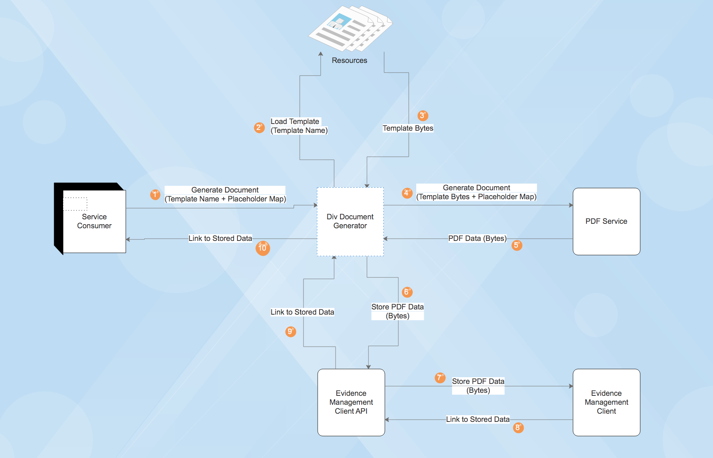

# Document Generator

[](https://opensource.org/licenses/MIT)
[](https://travis-ci.org/hmcts/prl-dgs-api)
[](https://app.codecov.io/gh/hmcts/prl-dgs-api)
[](https://tools.hmcts.net/confluence/display/PL/PDF+document+generator)

This is a document generation and template management service. This allows to generate documents based on a
given template name and placeholder data in JSON format and will also store the generated document in the
Document Management Store (via Case Document AM).

The service provides a single RESTful endpoint that will generate the document, store it in Evidence Management
Store and return the link to the stored data.

## Setup

**Prerequisites**

- [JDK 11](https://openjdk.java.net/)
- [Docker](https://www.docker.com)


***Building***

The project uses [Gradle](https://gradle.org) as a build tool but you don't have to install it locally since there is a
`./gradlew` wrapper script.

To build project please execute the following command:

```bash
./gradlew build
```

**Running**

First you need to create distribution by executing following command:

```bash
./gradlew installDist
```

To begin download the azure client cli:

```bash
brew update && brew install azure-cli
```

After it has finished downloaded run:

```bash
az login
```

This should open a browser window for you to login, use your HMCTS account

After logging in run the following command:

```bash
az acr login --name hmcts --subscription <ask the team for the secret>
```

Make sure you are connected to the VPN to before you run docker-compose up otherwise it won't be able to use the image.

When the distribution has been created in `build/install/prl-dgs-api` directory,
you can run the application by executing following command:

```bash
docker-compose up
```

As a result the following container(s) will get created and started:
 - long living container for API application exposing port `4007`

## Testing

**Integration tests**

To run all integration tests locally:

* Make a copy of `src/main/resources/example-application-aat.yml` as `src/main/resources/application-aat.yml`
* Make a copy of `src/integrationTest/resources/example-application-local.properties` as `src/integrationTest/resources/application-local.properties`
* Replace the `replace_me` secrets in the _newly created_ files. You can get the values from SCM and Azure secrets key vault (the new files are in .gitignore and should ***not*** be committed to git)
* Assuming you use IntelliJ, run your application
* And then run your gradle functional tests task
* Or if using command line:
    * Start the app with AAT config using `./gradlew clean bootRunAat`
    * Start the test with AAT config using `./gradlew clean functional`

If you update content in [templates](https://github.com/hmcts/rdo-docmosis-templates), you can re-generate the PDFs by running the ignored test `PDFGenerationTest.ignoreMe_updateGeneratedPdfs`. The test
will output generated PDFs to the folder `src/integrationTest/resources/documentgenerator/documents/regenerated`

**Unit tests**

To run all unit tests please execute following command:

```bash
./gradlew test
```

**Coding style tests**

To run all checks (including unit tests) please execute following command:

```bash
./gradlew check
```

**Mutation tests**

To run all mutation tests execute the following command:

```bash
./gradlew pitest
```

## Developing

**Flow Diagram**



**API documentation**

API documentation is provided with Swagger:
 - `http://localhost:4007/swagger-ui.html` - UI to interact with the API resources

**Versioning**

We use [SemVer](http://semver.org/) for versioning.
For the versions available, see the tags on this repository.

**Standard API**

We follow [RESTful API standards](https://hmcts.github.io/restful-api-standards/).

## License

This project is licensed under the MIT License - see the [LICENSE.md](LICENSE.md) file for details.
